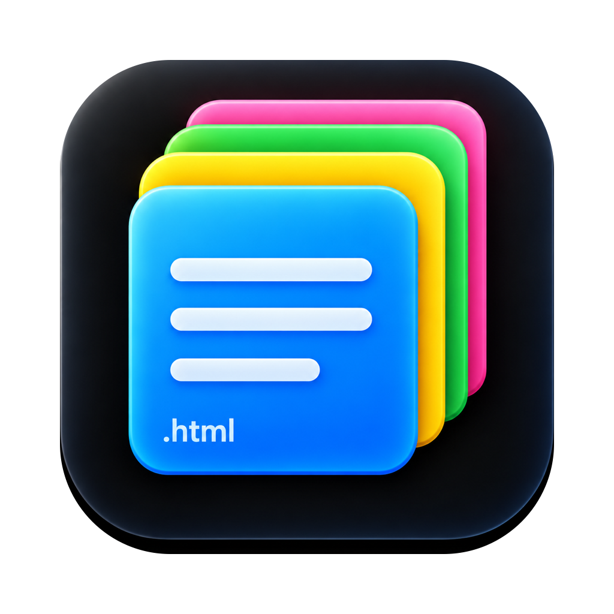

<div align="center">



# Noto

**A fast native macOS window onto every note you own.**

*Noto - ノート - notes.*

List all your notes, search titles and text, open one, find inside it, and write a new one.

[](https://github.com/bunlongheng/noto/actions/workflows/ci.yml)


</div>

---

## What it does

| | |
|---|---|
| **Lists every note** | Pages the API until it is exhausted, in the same order as the web All view |
| **Filter the list** | The sidebar field narrows the loaded list by title and folder, as you type |
| **Search all notes** | `Cmd+Shift+F` matches titles locally and note TEXT on the server |
| **New note** | `Cmd+N` writes a plain-text note |
| **Open a note** | HTML notes render with their real styling; anything else as plain text |
| **Find in note** | Highlights every match with a live counter, top right |
| **Move to Trash** | Cmd+Delete, the Finder gesture |

## Shortcuts

| Key | Action |
|---|---|
| `Cmd` `Shift` `F` | Search all notes, titles and text |
| `Cmd` `N` | New plain-text note |
| `Cmd` `F` | Find in the open note |
| `Cmd` `Delete` | Move the selected note to TRASH |
| `Cmd` `R` | Refresh |

## Run it

```bash
git clone https://github.com/bunlongheng/noto
cd noto
echo 'NOTO_API_KEY=sk_ext_your_key' > ~/.noto.env
./build.sh --install   # into /Applications, then launch it
```

`--run` builds and launches in place. `--install` copies the bundle to
`/Applications` so Launchpad, Spotlight and the Dock can open it; every later
`./build.sh` refreshes that installed copy automatically.

Requires macOS 14+, the Swift toolchain (Xcode Command Line Tools is enough), and the
notes server ([bunlongheng/stickies](https://github.com/bunlongheng/stickies)) reachable
at `http://localhost:4444`.

### Configuration

| Variable | Required | Where |
|---|---|---|
| `NOTO_API_KEY` | yes | environment, or `~/.noto.env` |

A missing key shows a setup message rather than crashing.

## Design

**Read-mostly on purpose.** It writes exactly twice: a new plain-text note, and
moving a note to TRASH.
It never edits note content - an earlier version round-tripped HTML through
`NSAttributedString` on a 3 second autosave, which silently rewrote hand-authored
markup. That whole path is gone.

**Trash is a move, not a delete.** `Cmd+Delete` issues the same PATCH the web app
does - `folder_name: "TRASH"` plus `trashed_at` - so the note stays recoverable
until the server's own 7 day cleanup. A hard delete is refused for API keys by
design, server side.

**Notes cannot execute anything.** Note HTML renders under a
`default-src 'none'` Content Security Policy, and script tags and inline handlers
are stripped before loading. The find highlighter runs in an isolated
`WKContentWorld`, which the CSP does not apply to - so it works while note scripts
stay blocked. Both halves are covered by tests.

## Layout

```
Sources/Noto/
  App.swift            @main scene, menu commands, split view, toolbar
  AppState.swift       observable state: notes, selection, filter, toast
  Config.swift         API key resolution
  NoteIcon.swift       Heroicon / app tokens to SF Symbols
  NoteDetailView.swift WKWebView renderer, CSP, find highlighter
  Models/Note.swift    Codable model and formatting
  Models/APIClient.swift  read-only client, paging, trash
Tests/                 assertions, run by ./test.sh
```

## Tests

```bash
./test.sh
```

Compiles the sources and `Tests/` with `swiftc` and runs them. SwiftPM is not used:
`swift build` fails to link its manifest on a CommandLineTools-only toolchain, so
XCTest and swift-testing are unavailable there. This runs identically locally and in
CI and exits non-zero on failure.

## Build notes

`build.sh` produces a universal (arm64 + x86_64) bundle, compiled in **Swift 6
language mode** and signed ad-hoc. `Package.swift` is kept so the project also
builds under full Xcode, but `build.sh` is the supported path.

**Distribution:** local builds are ad-hoc signed, not notarized, so `spctl` rejects
them. Copying the `.app` to another Mac needs right-click then Open the first time.
Set `SIGN_IDENTITY` to build with a Developer ID instead.

## License

MIT - see [LICENSE](LICENSE).
